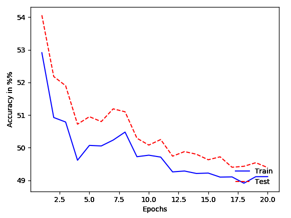

# pyTsetlinMachine
forked from cair/pyTsetlinMachine

Read https://github.com/cair/pyTsetlinMachine/blob/master/README.md for original readme

This forked repository added few incremental features to python program at "examples/MNISTDemo.py". 
The new python program is "MNIST_J/MNISTDemo_savefig.py"."

The added features include: 
1) Providing parser for command-line options that allow user set the specifications of the Tsetlin Machine before the execution of the program
2) Adding plotting the results and save as 'png'
3) Adding timestamp to outputs

## Required Additional Python3 packages
matplotlib

## Usage
```
 python3 MNISTDemo_savefig.py --c 30 --s 20 --t 20 --e 20
```
Explain: To run MNIST demo at clauses is 30 in total, S is 20, T 20, epochs is 20.

## Example Outputs

```
Using TensorFlow backend.
Current run: clause= 30 T= 20 S= 20.0 time@ 16292928012020
# 1 Epoch: Test accuracy: 54.06%, Training accuracy: 52.91%
# 2 Epoch: Test accuracy: 52.18%, Training accuracy: 50.92%
.
.
.
# 18 Epoch: Test accuracy: 49.43%, Training accuracy: 48.91%
# 19 Epoch: Test accuracy: 49.54%, Training accuracy: 49.11%
# 20 Epoch: Test accuracy: 49.39%, Training accuracy: 49.11%
```





